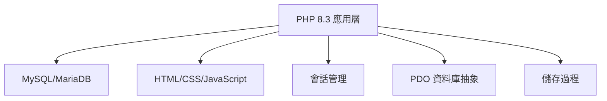
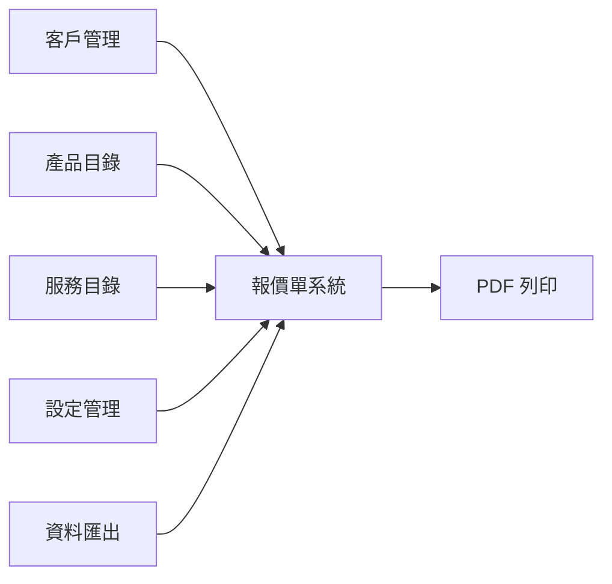

# Quotabase-Lite: 整合報價管理系統

**專案願景**: 為中小企業提供簡潔、高效、可信賴的報價管理解決方案

**專案狀態**: ✅ 規範完成，質量檢查透過，準備實施 (2025-11-05 20:15:00)

**質量驗證**: 100/100 項質量檢查透過 ✅

---

## 📋 專案概述

Quotabase-Lite 是一個專為中小企業設計的 iOS 風格報價單管理系統，專注於核心業務流程的簡潔性和易用性。專案採用 **零框架、零 Composer** 的極簡架構，確保系統輕量、易維護、易擴充套件。

### 核心價值主張

- **極簡架構**: 純 PHP 8.3，無需複雜依賴
- **精確財務**: 金額以分儲存，避免浮點精度問題
- **iOS 體驗**: 現代化介面，底部 Tab 導航，Dark Mode
- **資料安全**: 事務原子性，併發安全，XSS/CSRF 防護
- **專業輸出**: A4 格式列印，表頭固定，支援 PDF 匯出

---

## 🏗️ 系統架構總覽

### 技術棧



### 核心模組



---

## 📦 模組索引

### 核心業務模組

| 模組 | 路徑 | 狀態 | 說明 |
|------|------|------|------|
| **客戶管理** | `/customers/` | 📋 規範已完成 | CRUD 操作，支援軟刪除 |
| **產品管理** | `/products/` | 📋 規範已完成 | 產品目錄，SKU 唯一性 |
| **服務管理** | `/services/` | 📋 規範已完成 | 服務目錄，與產品共用表 |
| **報價單系統** | `/quotes/` | 📋 規範已完成 | 核心業務，事務安全 |
| **設定管理** | `/settings/` | 📋 規範已完成 | 系統配置，公司資訊 |
| **資料匯出** | `/exports/` | 📋 規範已完成 | CSV/JSON 匯出 |

### 共享元件

| 元件 | 路徑 | 說明 |
|------|------|------|
| **UI 元件** | `/partials/ui.php` | 底部導航、頁首 |
| **工具函式** | `/helpers/functions.php` | h() 轉義、金額格式化 |
| **資料庫層** | `/db.php` | PDO 連線、錯誤處理 |
| **樣式資源** | `/assets/style.css` | iOS 風格、Dark Mode、列印樣式 |

### 文件模組

| 模組 | 路徑 | 說明 |
|------|------|------|
| **特性規範** | `/specs/002-integrated-quote-system/` | 完整需求、API、資料模型 |
| **任務清單** | `/specs/002-integrated-quote-system/tasks.md` | 67 個實現任務 |
| **質量檢查** | `/specs/002-integrated-quote-system/checklists/` | 需求質量驗證 |
| **API 契約** | `/specs/002-integrated-quote-system/contracts/` | 6 個模組 API 定義 |

---

## 📊 專案統計

```
文件覆蓋率:
✅ 需求規格 (spec.md)          - 100%
✅ 技術計劃 (plan.md)          - 100%
✅ 資料模型 (data-model.md)    - 100%
✅ API 契約 (contracts/)       - 100%
✅ 任務清單 (tasks.md)         - 100%
✅ 快速開始 (quickstart.md)    - 100%
✅ 質量檢查 (checklists/)      - 100%

任務進度:
總任務數: 67
Phase 1 (Setup): 5 任務
Phase 2 (Foundational): 6 任務
使用者故事: 45 任務
資料匯出: 4 任務
最佳化: 7 任務

使用者故事:
🎯 US1: iOS 導航 (P1) - 6 任務
🎯 US2: 客戶管理 (P1) - 7 任務
🎯 US3: 目錄管理 (P1) - 9 任務
🎯 US4: 報價系統 (P1) - 11 任務
🎯 US5: 設定管理 (P2) - 5 任務
🎯 US6: 列印功能 (P2) - 7 任務
```

---

## 🎯 當前階段

**階段**: 規劃完成，準備實施

**下一步**:
1. 開始 Phase 1: 專案基礎設施搭建
2. 完成 Phase 2: 基礎元件開發
3. 並行實施 P1 使用者故事 (US1-US4)
4. 交付核心 MVP 系統

---

## 🏛️ 全域性開發規範

### 架構原則

- **零框架**: 僅使用 PHP 核心功能，無 Composer 依賴
- **路由即檔名**: 清晰直觀的 URL 結構
- **單檔案 ≤ 300 行**: 保持程式碼可讀性
- **模組化**: 每個功能模組獨立組織

### 安全規範

- **PDO 預處理**: 所有 SQL 操作使用佔位符
- **XSS 防護**: h() 函式統一轉義輸出
- **CSRF 驗證**: 所有 POST 表單攜帶令牌
- **事務安全**: 報價單建立使用資料庫事務
- **併發控制**: SELECT...FOR UPDATE 防止重複編號

### 資料規範

- **金額儲存**: BIGINT UNSIGNED (分)
- **時間處理**: UTC 儲存，Asia/Taipei 顯示
- **精度控制**: DECIMAL(18,4) 數量，DECIMAL(5,2) 稅率
- **軟刪除**: active 欄位標記

### UI/UX 規範

- **iOS 風格**: 卡片佈局，大標題，底部導航
- **Dark Mode**: prefers-color-scheme 支援
- **Safe-Area**: env(safe-area-inset-bottom)
- **列印最佳化**: A4 格式，表頭固定，@media print

---

## 📖 關鍵文件

### 設計文件

1. **[需求規格](/specs/002-integrated-quote-system/spec.md)** - 使用者故事、功能需求、成功標準
2. **[技術計劃](/specs/002-integrated-quote-system/plan.md)** - 架構決策、技術棧、合規檢查
3. **[資料模型](/specs/002-integrated-quote-system/data-model.md)** - 7 個實體、關係、索引
4. **[API 契約](/specs/002-integrated-quote-system/contracts/)** - 6 個模組 API 定義
5. **[快速開始](/specs/002-integrated-quote-system/quickstart.md)** - 部署指南、配置說明
6. **[任務清單](/specs/002-integrated-quote-system/tasks.md)** - 67 個實現任務

### 質量保證

1. **[需求質量檢查](/specs/002-integrated-quote-system/checklists/comprehensive-quality.md)** - 100 項質量驗證
2. **[規格檢查清單](/specs/002-integrated-quote-system/checklists/requirements.md)** - 需求完整性驗證

---

## 🚀 快速開始

### 環境要求

- PHP 8.3+
- MySQL 8.0+ / MariaDB 10.6+
- Nginx / Apache
- 寶塔面板 (推薦)

### 實施步驟

1. 克隆專案
2. 配置資料庫 (參考 quickstart.md)
3. 執行 schema.sql
4. 配置 config.php
5. 開始任務實施 (參考 tasks.md)

---

## 📈 效能目標

| 操作 | 目標 | 測量 |
|------|------|------|
| 列表載入 | P95 ≤ 200ms | 報價、產品、客戶列表 |
| 報價建立 | ≤ 2 分鐘 | 5 個專案的標準報價單 |
| 列印輸出 | A4 格式 | 表頭固定，10+ 行分頁 |
| 併發支援 | 10+ 使用者 | 同時建立報價單 |

---

## 📝 版本資訊

- **當前版本**: v0.1.0 (規劃階段)
- **最低 PHP**: 8.3
- **最低 MySQL**: 8.0 / MariaDB 10.6
- **許可證**: MIT

---

## 👥 參與貢獻

### 開發流程

1. 閱讀 [Constitution v2.0.0](.specify/memory/constitution.md)
2. 確認需求規範 (spec.md)
3. 從任務清單選擇任務 (tasks.md)
4. 實施並遵循編碼規範
5. 執行質量檢查清單

### 程式碼規範

- 遵循 PHP 8.3 標準規範
- 單檔案 ≤ 300 行
- 路由即檔名
- 詳細註釋關鍵邏輯

---

## 📞 支援與聯絡

- **專案型別**: 單體 Web 應用
- **部署環境**: Linux + 寶塔面板
- **技術棧**: PHP 8.3 + MySQL + Nginx
- **設計模式**: 最小化架構，路由即檔名

---

**注意**: 本文件為 AI 輔助開發環境生成，包含了完整的專案上下文和開發指南。所有開發決策應參考對應的詳細文件。

<!-- 手動新增內容區域 -->
<!-- MANUAL ADDITIONS START -->

<!-- MANUAL ADDITIONS END -->
