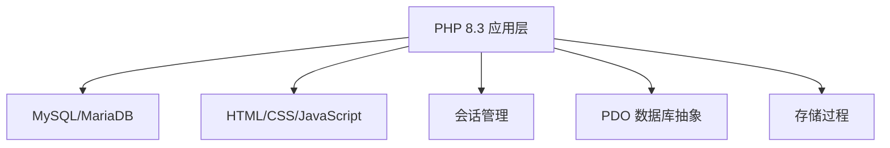
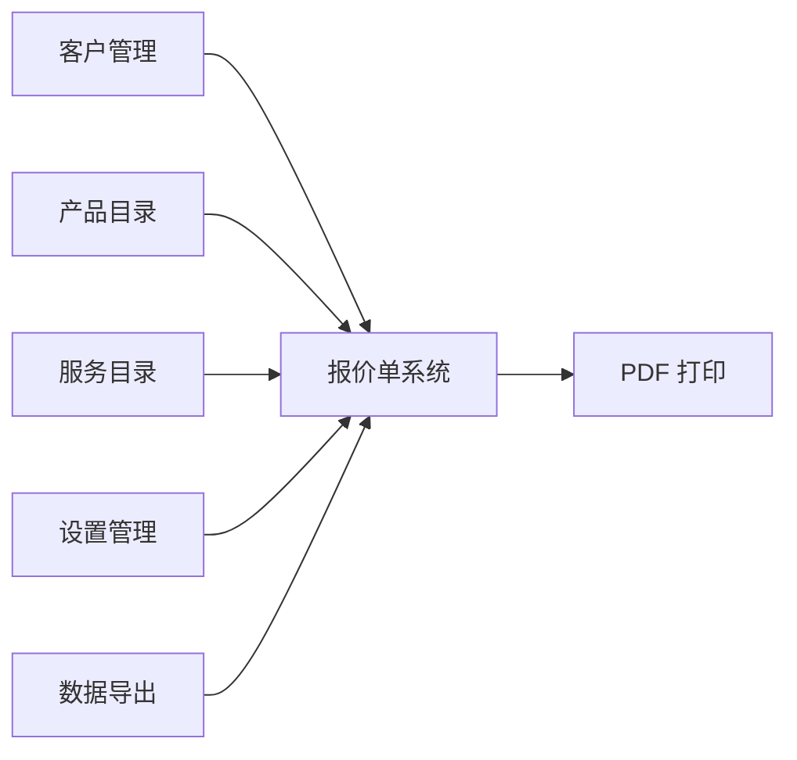

# Quotabase-Lite: 集成报价管理系统

**项目愿景**: 为中小企业提供简洁、高效、可信赖的报价管理解决方案

**项目状态**: ✅ 规范完成，质量检查通过，准备实施 (2025-11-05 20:15:00)

**质量验证**: 100/100 项质量检查通过 ✅

---

## 📋 项目概述

Quotabase-Lite 是一个专为中小企业设计的 iOS 风格报价单管理系统，专注于核心业务流程的简洁性和易用性。项目采用 **零框架、零 Composer** 的极简架构，确保系统轻量、易维护、易扩展。

### 核心价值主张

- **极简架构**: 纯 PHP 8.3，无需复杂依赖
- **精确财务**: 金额以分存储，避免浮点精度问题
- **iOS 体验**: 现代化界面，底部 Tab 导航，Dark Mode
- **数据安全**: 事务原子性，并发安全，XSS/CSRF 防护
- **专业输出**: A4 格式打印，表头固定，支持 PDF 导出

---

## 🏗️ 系统架构总览

### 技术栈



### 核心模块



---

## 📦 模块索引

### 核心业务模块

| 模块 | 路径 | 状态 | 说明 |
|------|------|------|------|
| **客户管理** | `/customers/` | 📋 规范已完成 | CRUD 操作，支持软删除 |
| **产品管理** | `/products/` | 📋 规范已完成 | 产品目录，SKU 唯一性 |
| **服务管理** | `/services/` | 📋 规范已完成 | 服务目录，与产品共用表 |
| **报价单系统** | `/quotes/` | 📋 规范已完成 | 核心业务，事务安全 |
| **设置管理** | `/settings/` | 📋 规范已完成 | 系统配置，公司信息 |
| **数据导出** | `/exports/` | 📋 规范已完成 | CSV/JSON 导出 |

### 共享组件

| 组件 | 路径 | 说明 |
|------|------|------|
| **UI 组件** | `/partials/ui.php` | 底部导航、页首 |
| **工具函数** | `/helpers/functions.php` | h() 转义、金额格式化 |
| **数据库层** | `/db.php` | PDO 连接、错误处理 |
| **样式资源** | `/assets/style.css` | iOS 风格、Dark Mode、打印样式 |

### 文档模块

| 模块 | 路径 | 说明 |
|------|------|------|
| **特性规范** | `/specs/002-integrated-quote-system/` | 完整需求、API、数据模型 |
| **任务清单** | `/specs/002-integrated-quote-system/tasks.md` | 67 个实现任务 |
| **质量检查** | `/specs/002-integrated-quote-system/checklists/` | 需求质量验证 |
| **API 契约** | `/specs/002-integrated-quote-system/contracts/` | 6 个模块 API 定义 |

---

## 📊 项目统计

```
文档覆盖率:
✅ 需求规格 (spec.md)          - 100%
✅ 技术计划 (plan.md)          - 100%
✅ 数据模型 (data-model.md)    - 100%
✅ API 契约 (contracts/)       - 100%
✅ 任务清单 (tasks.md)         - 100%
✅ 快速开始 (quickstart.md)    - 100%
✅ 质量检查 (checklists/)      - 100%

任务进度:
总任务数: 67
Phase 1 (Setup): 5 任务
Phase 2 (Foundational): 6 任务
用户故事: 45 任务
数据导出: 4 任务
优化: 7 任务

用户故事:
🎯 US1: iOS 导航 (P1) - 6 任务
🎯 US2: 客户管理 (P1) - 7 任务
🎯 US3: 目录管理 (P1) - 9 任务
🎯 US4: 报价系统 (P1) - 11 任务
🎯 US5: 设置管理 (P2) - 5 任务
🎯 US6: 打印功能 (P2) - 7 任务
```

---

## 🎯 当前阶段

**阶段**: 规划完成，准备实施

**下一步**:
1. 开始 Phase 1: 项目基础设施搭建
2. 完成 Phase 2: 基础组件开发
3. 并行实施 P1 用户故事 (US1-US4)
4. 交付核心 MVP 系统

---

## 🏛️ 全局开发规范

### 架构原则

- **零框架**: 仅使用 PHP 核心功能，无 Composer 依赖
- **路由即文件名**: 清晰直观的 URL 结构
- **单文件 ≤ 300 行**: 保持代码可读性
- **模块化**: 每个功能模块独立组织

### 安全规范

- **PDO 预处理**: 所有 SQL 操作使用占位符
- **XSS 防护**: h() 函数统一转义输出
- **CSRF 验证**: 所有 POST 表单携带令牌
- **事务安全**: 报价单创建使用数据库事务
- **并发控制**: SELECT...FOR UPDATE 防止重复编号

### 数据规范

- **金额存储**: BIGINT UNSIGNED (分)
- **时间处理**: UTC 存储，Asia/Taipei 显示
- **精度控制**: DECIMAL(18,4) 数量，DECIMAL(5,2) 税率
- **软删除**: active 字段标记

### UI/UX 规范

- **iOS 风格**: 卡片布局，大标题，底部导航
- **Dark Mode**: prefers-color-scheme 支持
- **Safe-Area**: env(safe-area-inset-bottom)
- **打印优化**: A4 格式，表头固定，@media print

---

## 📖 关键文档

### 设计文档

1. **[需求规格](/specs/002-integrated-quote-system/spec.md)** - 用户故事、功能需求、成功标准
2. **[技术计划](/specs/002-integrated-quote-system/plan.md)** - 架构决策、技术栈、合规检查
3. **[数据模型](/specs/002-integrated-quote-system/data-model.md)** - 7 个实体、关系、索引
4. **[API 契约](/specs/002-integrated-quote-system/contracts/)** - 6 个模块 API 定义
5. **[快速开始](/specs/002-integrated-quote-system/quickstart.md)** - 部署指南、配置说明
6. **[任务清单](/specs/002-integrated-quote-system/tasks.md)** - 67 个实现任务

### 质量保证

1. **[需求质量检查](/specs/002-integrated-quote-system/checklists/comprehensive-quality.md)** - 100 项质量验证
2. **[规格检查清单](/specs/002-integrated-quote-system/checklists/requirements.md)** - 需求完整性验证

---

## 🚀 快速开始

### 环境要求

- PHP 8.3+
- MySQL 8.0+ / MariaDB 10.6+
- Nginx / Apache
- 宝塔面板 (推荐)

### 实施步骤

1. 克隆项目
2. 配置数据库 (参考 quickstart.md)
3. 执行 schema.sql
4. 配置 config.php
5. 开始任务实施 (参考 tasks.md)

---

## 📈 性能目标

| 操作 | 目标 | 测量 |
|------|------|------|
| 列表加载 | P95 ≤ 200ms | 报价、产品、客户列表 |
| 报价创建 | ≤ 2 分钟 | 5 个项目的标准报价单 |
| 打印输出 | A4 格式 | 表头固定，10+ 行分页 |
| 并发支持 | 10+ 用户 | 同时创建报价单 |

---

## 📝 版本信息

- **当前版本**: v0.1.0 (规划阶段)
- **最低 PHP**: 8.3
- **最低 MySQL**: 8.0 / MariaDB 10.6
- **许可证**: MIT

---

## 👥 参与贡献

### 开发流程

1. 阅读 [Constitution v2.0.0](.specify/memory/constitution.md)
2. 确认需求规范 (spec.md)
3. 从任务清单选择任务 (tasks.md)
4. 实施并遵循编码规范
5. 运行质量检查清单

### 代码规范

- 遵循 PHP 8.3 标准规范
- 单文件 ≤ 300 行
- 路由即文件名
- 详细注释关键逻辑

---

## 📞 支持与联系

- **项目类型**: 单体 Web 应用
- **部署环境**: Linux + 宝塔面板
- **技术栈**: PHP 8.3 + MySQL + Nginx
- **设计模式**: 最小化架构，路由即文件名

---

**注意**: 本文档为 AI 辅助开发环境生成，包含了完整的项目上下文和开发指南。所有开发决策应参考对应的详细文档。

<!-- 手动添加内容区域 -->
<!-- MANUAL ADDITIONS START -->

<!-- MANUAL ADDITIONS END -->
