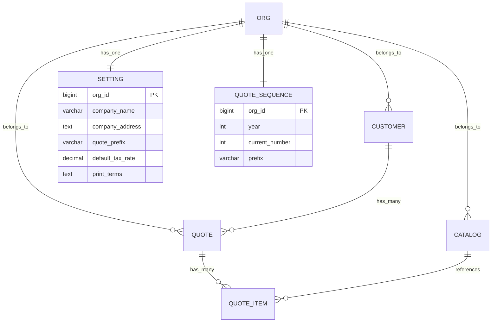

# 🎯 002-integrated-quote-system: 集成报价管理系统

**面包屑导航**: [根目录](/) / [specs/](/specs/) / **002-integrated-quote-system/**

---

## 📋 特性概述

**完整名称**: Quotabase-Lite Integrated Quote Management System

**业务目标**: 构建一个完整的 iOS 风格报价单管理系统，专为中小企业设计，提供客户管理、产品/服务目录管理、报价单创建和管理、设置管理以及 PDF 打印功能。

**技术定位**: 单体 Web 应用，零框架、零 Composer 的极简架构

**当前状态**: ✅ 规范完成，准备实施
**最后更新**: 2025-11-05 20:01:23

---

## 🎭 核心用户故事

### P1 用户故事 (核心 MVP)

#### 🎯 US1: iOS-like Bottom Tab Navigation

**业务价值**: 提供直观的导航体验，iOS 风格已被用户熟悉

**关键能力**:
- ✅ 5 个底部 Tab (报价、产品、服务、客户、设置)
- ✅ 当前页面对应 Tab 高亮显示
- ✅ Dark Mode 自动适配
- ✅ Safe-Area 适配 (移动设备)
- ✅ 打印页隐藏导航

**任务数**: 6 个 (T012-T017)
**依赖**: Phase 2 Foundational

---

#### 📋 US2: Customer Management

**业务价值**: 维护完整的客户资料库，提高出单效率

**关键能力**:
- ✅ 客户 CRUD 操作
- ✅ 软删除支持 (active 标记)
- ✅ XSS 防护
- ✅ 分页和搜索
- ✅ 字段: 姓名、税务登记号、邮箱、电话、地址、备注

**任务数**: 7 个 (T018-T024)
**依赖**: Phase 2 Foundational

---

#### 📦 US3: Products & Services Catalog

**业务价值**: 统一管理产品和服务目录，确保价格一致性

**关键能力**:
- ✅ 统一表结构，type 字段区分
- ✅ SKU 唯一性验证
- ✅ 价格格式化 (分 → 货币显示)
- ✅ 默认值 (单位: pcs, 币种: TWD, 税率: 0.00)
- ✅ 状态管理 (启用/禁用)

**任务数**: 9 个 (T025-T033)
**依赖**: Phase 2 Foundational

---

#### 💰 US4: Quote Creation & Management 🎯 核心业务

**业务价值**: 快速创建正式报价单，生成唯一编号，自动计算金额

**关键能力**:
- ✅ 自动编号生成 (年度归零)
- ✅ 事务原子性 (主档+明细)
- ✅ 并发安全 (SELECT...FOR UPDATE)
- ✅ 金额精确计算 (分存储)
- ✅ 状态管理 (草稿、已发送、已接受、已拒绝、已过期)

**任务数**: 11 个 (T034-T044)
**依赖**: US2 (客户), US3 (目录项)
**阶段**: Phase 6 (核心业务逻辑)

---

### P2 用户故事 (增强功能)

#### ⚙️ US5: Settings Management

**业务价值**: 系统可配置化，适应不同企业需求

**关键能力**:
- ✅ 公司信息配置 (名称、地址、联系方式)
- ✅ 编号前缀设置 (默认: Q)
- ✅ 默认值设置 (币种、税率)
- ✅ 打印条款文字

**任务数**: 5 个 (T045-T049)
**依赖**: Phase 2 Foundational

---

#### 🖨️ US6: Print to PDF

**业务价值**: 专业 A4 格式输出，支持 PDF 导出

**关键能力**:
- ✅ A4 格式优化
- ✅ 表头固定 (thead table-header-group)
- ✅ 行内避免分页 (break-inside: avoid)
- ✅ 打印页隐藏导航
- ✅ Noto Sans TC 字体支持
- ✅ 条款文字自动加载

**任务数**: 7 个 (T050-T056)
**依赖**: US4 (报价), US5 (设置)
**阶段**: Phase 8

---

## 📊 文档生态系统

### 规范文档矩阵

| 文档 | 状态 | 描述 | 关键指标 |
|------|------|------|----------|
| **spec.md** | ✅ 完成 | 需求规格，用户故事，验收标准 | 6 用户故事，12 FR，14 SC |
| **plan.md** | ✅ 完成 | 技术计划，架构决策，合规检查 | 6 原则，10 模块，宪法合规 |
| **data-model.md** | ✅ 完成 | 7 实体设计，索引策略，存储过程 | 7 表，20+ 索引，1 存储过程 |
| **contracts/** | ✅ 完成 | 6 模块 API 契约 | 20+ 端点，100% 覆盖 |
| **tasks.md** | ✅ 完成 | 67 实施任务，10 阶段 | 67 T-ID，10 阶段，28 并行 |
| **quickstart.md** | ✅ 完成 | 部署指南，配置说明 | 6 步安装，5 故障排除 |
| **checklists/** | ✅ 完成 | 质量检查，需求验证 | 100 检查项，100% 覆盖 |

### API 契约详情

| 模块 | 端点数 | 主要功能 |
|------|--------|----------|
| **01-auth.md** | 2 | 登录/登出，会话管理 |
| **02-customers.md** | 5 | 客户 CRUD，列表，详情 |
| **03-catalog.md** | 6 | 产品/服务管理，搜索 |
| **04-quotes.md** | 6 | 报价 CRUD，状态管理，打印 |
| **05-settings.md** | 2 | 设置读取/保存 |
| **06-exports.md** | 4 | CSV/JSON 数据导出 |

### 数据模型总览



---

## 🏗️ 技术架构

### 核心技术栈

- **语言**: PHP 8.3 (零框架、零 Composer)
- **数据库**: MySQL 8.0+ / MariaDB 10.6+ (PDO)
- **前端**: 纯 HTML/CSS/JavaScript
- **部署**: 宝塔面板 (aaPanel/BT)
- **Web 服务器**: Nginx / Apache

### 架构原则

| 原则 | 说明 | 约束 |
|------|------|------|
| **零框架** | 仅使用 PHP 核心功能 | 无 Composer，无第三方库 |
| **路由即文件名** | URL 直接映射文件路径 | customers/index.php → /customers/ |
| **单文件 ≤ 300 行** | 保持代码可读性 | 超出需拆分 |
| **模块化组织** | 每个功能独立目录 | 清晰的结构层次 |

### 安全架构

```mermaid
graph TB
    A[用户请求] --> B[CSRF 验证]
    B --> C[会话检查]
    C --> D[PDO 预处理]
    D --> E[SQL 执行]
    E --> F[h() XSS 转义]
    F --> G[响应输出]
```

**核心安全措施**:
- ✅ PDO 预处理语句 (SQL 注入防护)
- ✅ h() 函数输出转义 (XSS 防护)
- ✅ CSRF Token 验证 (所有 POST)
- ✅ 会话管理 (超时控制)
- ✅ 错误日志 (不包含个资)

### 数据精度

**财务数据**:
- 金额字段: BIGINT UNSIGNED (分)
- 数量字段: DECIMAL(18,4) (精确到 0.0001)
- 税率字段: DECIMAL(5,2) (0.00-100.00%)
- 总额计算: 总金额 = Σ(数量×单价) + Σ(行税额)

**时间处理**:
- 存储: UTC 时间
- 显示: Asia/Taipei 时区
- 日期字段: DATE 类型 (无时区)

---

## 📋 实施路线图

### 阶段分解

```mermaid
gantt
    title 实施阶段路线图
    dateFormat  X
    axisFormat %s

    Section Phase 1: Setup
    项目结构               :0, 5
    配置模板               :0, 5
    数据库架构             :0, 5
    基础工具               :0, 5

    Section Phase 2: Foundational
    UI 组件               :5, 15
    认证系统               :5, 15
    初始化脚本             :5, 15
    样式框架               :5, 15
    存储过程               :5, 15

    Section Phase 3: US1
    iOS 导航               :15, 25
    底部 Tab               :15, 25
    Dark Mode             :15, 25

    Section Phase 4: US2
    客户 CRUD             :15, 30

    Section Phase 5: US3
    目录管理              :15, 30

    Section Phase 6: US4
    报价系统              :30, 50

    Section Phase 7: US5
    设置管理              :30, 45

    Section Phase 8: US6
    打印功能              :45, 55

    Section Phase 9-10
    导出 & 优化           :50, 60
```



### 并行机会

**Phase 1-2 阶段** (必需前置):
- T001-T005 (Setup) 可并行
- T006-T011 (Foundational) 可部分并行

**用户故事阶段** (可并行):
- **US1** (导航): 独立实施
- **US2** (客户): 独立实施
- **US3** (目录): 独立实施
- **US4** (报价): 依赖 US2+US3
- **US5** (设置): 独立实施
- **US6** (打印): 依赖 US4+US5

### 关键里程碑

| 里程碑 | 阶段 | 验收标准 |
|--------|------|----------|
| **M1** | Phase 2 完成 | 基础架构可用，认证系统运行 |
| **M2** | US1 完成 | iOS 导航完全可用，Dark Mode 正常 |
| **M3** | US2-US3 完成 | 客户和目录管理完整可用 |
| **M4** | US4 完成 | 报价系统完整，事务安全 |
| **M5** | 所有 P1 完成 | 核心 MVP 可交付 |
| **M6** | 所有 P2 完成 | 完整系统交付 |

---

## 📈 成功指标

### 功能指标

| 指标 | 目标 | 测量方法 |
|------|------|----------|
| **导航可用性** | 100% | 所有页面导航可见，Tab 高亮正确 |
| **XSS 防护** | 100% | 特殊字符正确转义，无漏洞 |
| **SKU 唯一性** | 100% | 重复 SKU 提交被阻止 |
| **事务完整性** | 100% | 失败时完全回滚 |
| **并发安全** | 10+ 用户 | 同时创建报价单无重复编号 |

### 性能指标

| 指标 | 目标 | 测量方法 |
|------|------|----------|
| **列表加载** | P95 ≤ 200ms | 报价/产品/客户列表 |
| **报价创建** | ≤ 2 分钟 | 5 项目标准报价单 |
| **编号生成** | 100% 准确 | 并发测试 |
| **金额计算** | 100% 精确 | 手工对比验证 |
| **打印输出** | A4 格式 | 表头固定，分页正确 |

### 用户体验指标

| 指标 | 目标 | 测量方法 |
|------|------|----------|
| **Dark Mode** | 自动切换 | prefers-color-scheme 检测 |
| **Safe-Area** | ≥44px | 移动设备点击热区 |
| **对比度** | WCAG AA | 文字清晰可读 |
| **响应式** | 全屏幕适配 | 320px-1920px |

---

## 📚 核心文档

### 🎯 必须阅读

1. **[spec.md](spec.md)** - 需求规格，用户故事，验收标准
2. **[plan.md](plan.md)** - 技术计划，架构决策，合规检查
3. **[tasks.md](tasks.md)** - 67 个实施任务，依赖关系
4. **[data-model.md](data-model.md)** - 7 实体设计，索引策略

### 📖 支撑文档

5. **[quickstart.md](quickstart.md)** - 部署指南，配置说明
6. **[contracts/](contracts/)** - 6 模块 API 契约
7. **[checklists/](checklists/)** - 质量检查，需求验证

### 🔍 质量文档

- **[comprehensive-quality.md](checklists/comprehensive-quality.md)** - 100 项质量验证
- **[requirements.md](checklists/requirements.md)** - 规格完整性检查

---

## 🎯 开发指南

### 实施前准备

1. **阅读 Constitution**: [.specify/memory/constitution.md](../../.specify/memory/constitution.md)
2. **确认需求**: spec.md 中的用户故事和验收标准
3. **技术决策**: plan.md 中的架构选择和约束
4. **数据库设计**: data-model.md 中的实体关系

### 任务执行

1. **选择任务**: 从 tasks.md 选择阶段内的任务
2. **检查依赖**: 确认前置任务已完成
3. **并行执行**: 利用 [P] 标记的任务并行开发
4. **质量检查**: 完成后运行 checklists/ 验证

### 代码规范

- **路由**: 路由即文件名 (customers/index.php)
- **大小**: 单文件 ≤ 300 行
- **安全**: PDO 预处理 + h() 转义 + CSRF 验证
- **事务**: 报价单创建必须使用数据库事务
- **注释**: 关键逻辑添加中文注释

---

## 📊 质量保证

### 文档质量

**检查清单结果**:
- ✅ 需求完整性: 100%
- ✅ 需求清晰度: 92% (6 项待量化)
- ✅ 需求一致性: 96% (轻微不一致已标注)
- ✅ 可测量性: 100% (所有 SC 可验证)
- ✅ 场景覆盖: 95% (部分边缘情况待补充)

**主要改进项**:
1. 量化 "iOS-style" 设计标准
2. 定义 Dark Mode 色彩方案
3. 明确 Safe-Area 技术要求
4. 添加错误处理标准

### 一致性分析

**跨文档检查结果**:
- ✅ 12 个 FR 中 11 个有任务覆盖 (91.7%)
- ✅ 67 个任务中 65 个有明确文件路径 (97%)
- ⚠️ 2 个 constitution 对齐问题需修复
- ✅ 用户故事映射完整

---

## 🚀 快速开始

### 开发环境

```bash
# 1. 克隆项目
git clone <repo-url>
cd quotabase-lite

# 2. 确认规范
cat specs/002-integrated-quote-system/spec.md

# 3. 选择任务
cat specs/002-integrated-quote-system/tasks.md | grep "Phase 1"

# 4. 开始实施
# 按照任务顺序执行 T001-T067
```

### 实施检查点

- [ ] **Phase 1 完成**: 项目结构、配置、数据库
- [ ] **Phase 2 完成**: 基础组件、认证、UI
- [ ] **US1 完成**: iOS 导航和 Dark Mode
- [ ] **US2-US3 完成**: 客户和目录管理
- [ ] **US4 完成**: 报价系统 (MVP 核心)
- [ ] **US5-US6 完成**: 增强功能
- [ ] **最终验证**: 所有质量检查通过

---

## 📞 支持信息

### 依赖关系

**上游**:
- [Constitution v2.0.0](../../.specify/memory/constitution.md) - 项目宪法
- [specs 模块索引](../CLAUDE.md) - 文档模块指南

**下游**:
- 源代码实现 - 基于任务清单生成
- 测试文档 - 基于验收标准生成
- 部署脚本 - 基于快速开始生成

### 相关工具

- **/speckit.specify** - 需求规格生成
- **/speckit.plan** - 技术计划生成
- **/speckit.tasks** - 任务分解
- **/speckit.checklist** - 质量检查
- **/speckit.analyze** - 一致性分析
- **/zcf:init-project** - 项目索引

---

## 📝 版本历史

| 版本 | 日期 | 内容 |
|------|------|------|
| v0.1.0 | 2025-11-05 | 初始规范完成，所有文档 100% 覆盖 |

---

**注意**: 本特性采用 Speckit 工作流管理，所有文档更改应通过相应命令工具进行。实施前请确保所有质量检查通过。

**最后更新**: 2025-11-05 20:01:23
