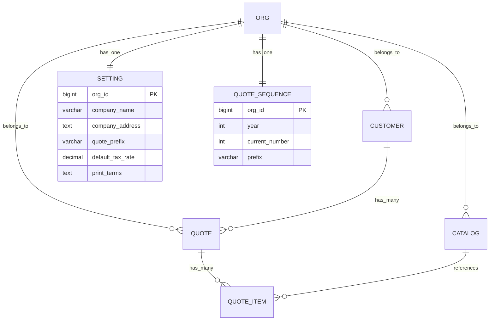

# 🎯 002-integrated-quote-system: 整合報價管理系統

**麵包屑導航**: [根目錄](/) / [specs/](/specs/) / **002-integrated-quote-system/**

---

## 📋 特性概述

**完整名稱**: Quotabase-Lite Integrated Quote Management System

**業務目標**: 構建一個完整的 iOS 風格報價單管理系統，專為中小企業設計，提供客戶管理、產品/服務目錄管理、報價單建立和管理、設定管理以及 PDF 列印功能。

**技術定位**: 單體 Web 應用，零框架、零 Composer 的極簡架構

**當前狀態**: ✅ 規範完成，準備實施
**最後更新**: 2025-11-05 20:01:23

---

## 🎭 核心使用者故事

### P1 使用者故事 (核心 MVP)

#### 🎯 US1: iOS-like Bottom Tab Navigation

**業務價值**: 提供直觀的導航體驗，iOS 風格已被使用者熟悉

**關鍵能力**:
- ✅ 5 個底部 Tab (報價、產品、服務、客戶、設定)
- ✅ 當前頁面對應 Tab 高亮顯示
- ✅ Dark Mode 自動適配
- ✅ Safe-Area 適配 (移動裝置)
- ✅ 列印頁隱藏導航

**任務數**: 6 個 (T012-T017)
**依賴**: Phase 2 Foundational

---

#### 📋 US2: Customer Management

**業務價值**: 維護完整的客戶資料庫，提高出單效率

**關鍵能力**:
- ✅ 客戶 CRUD 操作
- ✅ 軟刪除支援 (active 標記)
- ✅ XSS 防護
- ✅ 分頁和搜尋
- ✅ 欄位: 姓名、稅務登記號、郵箱、電話、地址、備註

**任務數**: 7 個 (T018-T024)
**依賴**: Phase 2 Foundational

---

#### 📦 US3: Products & Services Catalog

**業務價值**: 統一管理產品和服務目錄，確保價格一致性

**關鍵能力**:
- ✅ 統一表結構，type 欄位區分
- ✅ SKU 唯一性驗證
- ✅ 價格格式化 (分 → 貨幣顯示)
- ✅ 預設值 (單位: pcs, 幣種: TWD, 稅率: 0.00)
- ✅ 狀態管理 (啟用/停用)

**任務數**: 9 個 (T025-T033)
**依賴**: Phase 2 Foundational

---

#### 💰 US4: Quote Creation & Management 🎯 核心業務

**業務價值**: 快速建立正式報價單，生成唯一編號，自動計算金額

**關鍵能力**:
- ✅ 自動編號生成 (年度歸零)
- ✅ 事務原子性 (主檔+明細)
- ✅ 併發安全 (SELECT...FOR UPDATE)
- ✅ 金額精確計算 (分儲存)
- ✅ 狀態管理 (草稿、已傳送、已接受、已拒絕、已過期)

**任務數**: 11 個 (T034-T044)
**依賴**: US2 (客戶), US3 (目錄項)
**階段**: Phase 6 (核心業務邏輯)

---

### P2 使用者故事 (增強功能)

#### ⚙️ US5: Settings Management

**業務價值**: 系統可配置化，適應不同企業需求

**關鍵能力**:
- ✅ 公司資訊配置 (名稱、地址、聯絡方式)
- ✅ 編號字首設定 (預設: Q)
- ✅ 預設值設定 (幣種、稅率)
- ✅ 列印條款文字

**任務數**: 5 個 (T045-T049)
**依賴**: Phase 2 Foundational

---

#### 🖨️ US6: Print to PDF

**業務價值**: 專業 A4 格式輸出，支援 PDF 匯出

**關鍵能力**:
- ✅ A4 格式最佳化
- ✅ 表頭固定 (thead table-header-group)
- ✅ 行內避免分頁 (break-inside: avoid)
- ✅ 列印頁隱藏導航
- ✅ Noto Sans TC 字型支援
- ✅ 條款文字自動載入

**任務數**: 7 個 (T050-T056)
**依賴**: US4 (報價), US5 (設定)
**階段**: Phase 8

---

## 📊 文件生態系統

### 規範文件矩陣

| 文件 | 狀態 | 描述 | 關鍵指標 |
|------|------|------|----------|
| **spec.md** | ✅ 完成 | 需求規格，使用者故事，驗收標準 | 6 使用者故事，12 FR，14 SC |
| **plan.md** | ✅ 完成 | 技術計劃，架構決策，合規檢查 | 6 原則，10 模組，憲法合規 |
| **data-model.md** | ✅ 完成 | 7 實體設計，索引策略，儲存過程 | 7 表，20+ 索引，1 儲存過程 |
| **contracts/** | ✅ 完成 | 6 模組 API 契約 | 20+ 端點，100% 覆蓋 |
| **tasks.md** | ✅ 完成 | 67 實施任務，10 階段 | 67 T-ID，10 階段，28 並行 |
| **quickstart.md** | ✅ 完成 | 部署指南，配置說明 | 6 步安裝，5 故障排除 |
| **checklists/** | ✅ 完成 | 質量檢查，需求驗證 | 100 檢查項，100% 覆蓋 |

### API 契約詳情

| 模組 | 端點數 | 主要功能 |
|------|--------|----------|
| **01-auth.md** | 2 | 登入/登出，會話管理 |
| **02-customers.md** | 5 | 客戶 CRUD，列表，詳情 |
| **03-catalog.md** | 6 | 產品/服務管理，搜尋 |
| **04-quotes.md** | 6 | 報價 CRUD，狀態管理，列印 |
| **05-settings.md** | 2 | 設定讀取/儲存 |
| **06-exports.md** | 4 | CSV/JSON 資料匯出 |

### 資料模型總覽



---

## 🏗️ 技術架構

### 核心技術棧

- **語言**: PHP 8.3 (零框架、零 Composer)
- **資料庫**: MySQL 8.0+ / MariaDB 10.6+ (PDO)
- **前端**: 純 HTML/CSS/JavaScript
- **部署**: 寶塔面板 (aaPanel/BT)
- **Web 伺服器**: Nginx / Apache

### 架構原則

| 原則 | 說明 | 約束 |
|------|------|------|
| **零框架** | 僅使用 PHP 核心功能 | 無 Composer，無第三方庫 |
| **路由即檔名** | URL 直接對映檔案路徑 | customers/index.php → /customers/ |
| **單檔案 ≤ 300 行** | 保持程式碼可讀性 | 超出需拆分 |
| **模組化組織** | 每個功能獨立目錄 | 清晰的結構層次 |

### 安全架構

```mermaid
graph TB
    A[使用者請求] --> B[CSRF 驗證]
    B --> C[會話檢查]
    C --> D[PDO 預處理]
    D --> E[SQL 執行]
    E --> F[h() XSS 轉義]
    F --> G[響應輸出]
```

**核心安全措施**:
- ✅ PDO 預處理語句 (SQL 注入防護)
- ✅ h() 函式輸出轉義 (XSS 防護)
- ✅ CSRF Token 驗證 (所有 POST)
- ✅ 會話管理 (超時控制)
- ✅ 錯誤日誌 (不包含個資)

### 資料精度

**財務資料**:
- 金額欄位: BIGINT UNSIGNED (分)
- 數量欄位: DECIMAL(18,4) (精確到 0.0001)
- 稅率欄位: DECIMAL(5,2) (0.00-100.00%)
- 總額計算: 總金額 = Σ(數量×單價) + Σ(行稅額)

**時間處理**:
- 儲存: UTC 時間
- 顯示: Asia/Taipei 時區
- 日期欄位: DATE 型別 (無時區)

---

## 📋 實施路線圖

### 階段分解


### 並行機會

**Phase 1-2 階段** (必需前置):
- T001-T005 (Setup) 可並行
- T006-T011 (Foundational) 可部分並行

**使用者故事階段** (可並行):
- **US1** (導航): 獨立實施
- **US2** (客戶): 獨立實施
- **US3** (目錄): 獨立實施
- **US4** (報價): 依賴 US2+US3
- **US5** (設定): 獨立實施
- **US6** (列印): 依賴 US4+US5

### 關鍵里程碑

| 里程碑 | 階段 | 驗收標準 |
|--------|------|----------|
| **M1** | Phase 2 完成 | 基礎架構可用，認證系統執行 |
| **M2** | US1 完成 | iOS 導航完全可用，Dark Mode 正常 |
| **M3** | US2-US3 完成 | 客戶和目錄管理完整可用 |
| **M4** | US4 完成 | 報價系統完整，事務安全 |
| **M5** | 所有 P1 完成 | 核心 MVP 可交付 |
| **M6** | 所有 P2 完成 | 完整系統交付 |

---

## 📈 成功指標

### 功能指標

| 指標 | 目標 | 測量方法 |
|------|------|----------|
| **導航可用性** | 100% | 所有頁面導航可見，Tab 高亮正確 |
| **XSS 防護** | 100% | 特殊字元正確轉義，無漏洞 |
| **SKU 唯一性** | 100% | 重複 SKU 提交被阻止 |
| **事務完整性** | 100% | 失敗時完全回滾 |
| **併發安全** | 10+ 使用者 | 同時建立報價單無重複編號 |

### 效能指標

| 指標 | 目標 | 測量方法 |
|------|------|----------|
| **列表載入** | P95 ≤ 200ms | 報價/產品/客戶列表 |
| **報價建立** | ≤ 2 分鐘 | 5 專案標準報價單 |
| **編號生成** | 100% 準確 | 併發測試 |
| **金額計算** | 100% 精確 | 手工對比驗證 |
| **列印輸出** | A4 格式 | 表頭固定，分頁正確 |

### 使用者體驗指標

| 指標 | 目標 | 測量方法 |
|------|------|----------|
| **Dark Mode** | 自動切換 | prefers-color-scheme 檢測 |
| **Safe-Area** | ≥44px | 移動裝置點選熱區 |
| **對比度** | WCAG AA | 文字清晰可讀 |
| **響應式** | 全螢幕適配 | 320px-1920px |

---

## 📚 核心文件

### 🎯 必須閱讀

1. **[spec.md](spec.md)** - 需求規格，使用者故事，驗收標準
2. **[plan.md](plan.md)** - 技術計劃，架構決策，合規檢查
3. **[tasks.md](tasks.md)** - 67 個實施任務，依賴關係
4. **[data-model.md](data-model.md)** - 7 實體設計，索引策略

### 📖 支撐文件

5. **[quickstart.md](quickstart.md)** - 部署指南，配置說明
6. **[contracts/](contracts/)** - 6 模組 API 契約
7. **[checklists/](checklists/)** - 質量檢查，需求驗證

### 🔍 質量文件

- **[comprehensive-quality.md](checklists/comprehensive-quality.md)** - 100 項質量驗證
- **[requirements.md](checklists/requirements.md)** - 規格完整性檢查

---

## 🎯 開發指南

### 實施前準備

1. **閱讀 Constitution**: [.specify/memory/constitution.md](../../.specify/memory/constitution.md)
2. **確認需求**: spec.md 中的使用者故事和驗收標準
3. **技術決策**: plan.md 中的架構選擇和約束
4. **資料庫設計**: data-model.md 中的實體關係

### 任務執行

1. **選擇任務**: 從 tasks.md 選擇階段內的任務
2. **檢查依賴**: 確認前置任務已完成
3. **並行執行**: 利用 [P] 標記的任務並行開發
4. **質量檢查**: 完成後執行 checklists/ 驗證

### 程式碼規範

- **路由**: 路由即檔名 (customers/index.php)
- **大小**: 單檔案 ≤ 300 行
- **安全**: PDO 預處理 + h() 轉義 + CSRF 驗證
- **事務**: 報價單建立必須使用資料庫事務
- **註釋**: 關鍵邏輯新增中文註釋

---

## 📊 質量保證

### 文件質量

**檢查清單結果**:
- ✅ 需求完整性: 100%
- ✅ 需求清晰度: 92% (6 項待量化)
- ✅ 需求一致性: 96% (輕微不一致已標註)
- ✅ 可測量性: 100% (所有 SC 可驗證)
- ✅ 場景覆蓋: 95% (部分邊緣情況待補充)

**主要改進項**:
1. 量化 "iOS-style" 設計標準
2. 定義 Dark Mode 色彩方案
3. 明確 Safe-Area 技術要求
4. 新增錯誤處理標準

### 一致性分析

**跨文件檢查結果**:
- ✅ 12 個 FR 中 11 個有任務覆蓋 (91.7%)
- ✅ 67 個任務中 65 個有明確檔案路徑 (97%)
- ⚠️ 2 個 constitution 對齊問題需修復
- ✅ 使用者故事對映完整

---

## 🚀 快速開始

### 開發環境

```bash
# 1. 克隆專案
git clone <repo-url>
cd quotabase-lite

# 2. 確認規範
cat specs/002-integrated-quote-system/spec.md

# 3. 選擇任務
cat specs/002-integrated-quote-system/tasks.md | grep "Phase 1"

# 4. 開始實施
# 按照任務順序執行 T001-T067
```

### 實施檢查點

- [ ] **Phase 1 完成**: 專案結構、配置、資料庫
- [ ] **Phase 2 完成**: 基礎元件、認證、UI
- [ ] **US1 完成**: iOS 導航和 Dark Mode
- [ ] **US2-US3 完成**: 客戶和目錄管理
- [ ] **US4 完成**: 報價系統 (MVP 核心)
- [ ] **US5-US6 完成**: 增強功能
- [ ] **最終驗證**: 所有質量檢查透過

---

## 📞 支援資訊

### 依賴關係

**上游**:
- [Constitution v2.0.0](../../.specify/memory/constitution.md) - 專案憲法
- [specs 模組索引](../CLAUDE.md) - 文件模組指南

**下游**:
- 原始碼實現 - 基於任務清單生成
- 測試文件 - 基於驗收標準生成
- 部署指令碼 - 基於快速開始生成

### 相關工具

- **/speckit.specify** - 需求規格生成
- **/speckit.plan** - 技術計劃生成
- **/speckit.tasks** - 任務分解
- **/speckit.checklist** - 質量檢查
- **/speckit.analyze** - 一致性分析
- **/zcf:init-project** - 專案索引

---

## 📝 版本歷史

| 版本 | 日期 | 內容 |
|------|------|------|
| v0.1.0 | 2025-11-05 | 初始規範完成，所有文件 100% 覆蓋 |

---

**注意**: 本特性採用 Speckit 工作流管理，所有文件更改應透過相應命令工具進行。實施前請確保所有質量檢查透過。

**最後更新**: 2025-11-05 20:01:23
