# 📦 规范文档模块 (specs/)

**面包屑导航**: [根目录](/) / **specs/**

---

## 📋 模块概述

本模块包含 Quotabase-Lite 项目的所有规范文档，采用 **特性驱动** 的文档组织方式。每个特性都有独立的子目录，包含完整的设计、实施和质量保证文档。

### 文档哲学

- **设计先行**: 所有实现前必须有完整的规范文档
- **多视角完整性**: 需求、设计、任务、质量检查全覆盖
- **可追溯性**: 用户故事 → 功能需求 → 实现任务
- **质量门禁**: 规范质量检查清单确保文档质量

---

## 📁 目录结构

```
specs/
├── CLAUDE.md                           # 本文件
└── 002-integrated-quote-system/        # 集成报价系统特性
    ├── spec.md                         # 需求规格文档
    ├── plan.md                         # 技术实施计划
    ├── data-model.md                   # 数据模型设计
    ├── quickstart.md                   # 快速开始指南
    ├── tasks.md                        # 实施任务清单
    ├── contracts/                      # API 契约目录
    │   ├── 01-auth.md                  # 认证接口
    │   ├── 02-customers.md             # 客户管理接口
    │   ├── 03-catalog.md               # 目录管理接口
    │   ├── 04-quotes.md                # 报价单接口
    │   ├── 05-settings.md              # 设置管理接口
    │   └── 06-exports.md               # 数据导出接口
    └── checklists/                     # 质量检查目录
        ├── requirements.md             # 需求质量检查
        └── comprehensive-quality.md    # 综合质量检查
```

---

## 🎯 当前特性

### 002-integrated-quote-system: 集成报价管理系统

**状态**: ✅ 规范完成，准备实施
**优先级**: P1 (核心业务)
**文档完成度**: 100%

#### 📊 规范覆盖

| 文档类型 | 完成状态 | 描述 |
|----------|----------|------|
| **需求规格** (spec.md) | ✅ 100% | 6 个用户故事，12 个功能需求，14 个成功标准 |
| **技术计划** (plan.md) | ✅ 100% | 架构决策，宪法合规性检查，项目结构 |
| **数据模型** (data-model.md) | ✅ 100% | 7 个实体，完整字段定义，索引策略 |
| **API 契约** (contracts/) | ✅ 100% | 6 个模块，20+ 端点，完整请求/响应 |
| **任务清单** (tasks.md) | ✅ 100% | 67 个任务，10 个阶段，完整依赖关系 |
| **快速开始** (quickstart.md) | ✅ 100% | 6 步部署，配置说明，故障排除 |
| **质量检查** (checklists/) | ✅ 100% | 100 项质量验证，需求完整性检查 |

#### 🎯 用户故事

| 优先级 | 用户故事 | 任务数 | 说明 |
|--------|----------|--------|------|
| P1 | **US1**: iOS-like Bottom Tab Navigation | 6 | 底部导航，Dark Mode，Safe-Area |
| P1 | **US2**: Customer Management | 7 | 客户 CRUD，XSS 防护 |
| P1 | **US3**: Products & Services Catalog | 9 | 统一表结构，SKU 唯一性 |
| P1 | **US4**: Quote Creation & Management | 11 | 核心业务，事务安全 |
| P2 | **US5**: Settings Management | 5 | 系统配置，默认值 |
| P2 | **US6**: Print to PDF | 7 | A4 格式，表头固定 |

#### 📋 关键指标

- **文档总数**: 14 个文件
- **文档覆盖率**: 100%
- **任务总数**: 67 个
- **并行任务数**: 28 个 ([P] 标记)
- **实施阶段**: 10 个阶段
- **质量检查项**: 100 项

---

## 📖 文档类型说明

### 需求规范 (specification)

**文件**: `spec.md`

**内容**:
- 🎭 用户故事 (6 个，优先级明确)
- ✅ 功能需求 (FR-001 到 FR-012)
- 📏 成功标准 (SC-001 到 SC-014)
- 🎪 验收场景 (Given/When/Then)
- 🔍 边缘情况处理

**用途**: 开发前的需求确认，验收测试的依据

### 技术计划 (planning)

**文件**: `plan.md`

**内容**:
- 🏗️ 技术栈选择 (PHP 8.3, MySQL, 零框架)
- 📐 项目结构设计
- ✅ 宪法合规性检查 (6 大原则)
- 🔄 实施工作流

**用途**: 架构决策，技术选型，开发流程

### 数据模型 (data model)

**文件**: `data-model.md`

**内容**:
- 🗃️ 实体定义 (7 个核心实体)
- 🔗 关系设计 (外键，索引)
- 📊 精度选择 (DECIMAL, BIGINT)
- 🔒 安全考虑 (SQL 注入，XSS 防护)
- ⚙️ 存储过程 (next_quote_number)

**用途**: 数据库设计，性能优化，数据一致性

### API 契约 (contracts)

**目录**: `contracts/`

**内容**:
- 📡 API 端点定义
- 📝 请求/响应格式
- ⚠️ 错误处理机制
- ✅ 验证规则
- 🔐 安全要求

**用途**: 前后端协作，接口对齐，测试依据

### 实施任务 (tasks)

**文件**: `tasks.md`

**内容**:
- ✅ 任务清单 (T001-T067)
- 📦 阶段划分 (Phase 1-10)
- 🏷️ 并行标记 ([P])
- 👥 用户故事映射 ([US1-US6])
- 🔗 依赖关系图

**用途**: 开发计划，任务分配，进度跟踪

### 快速开始 (quickstart)

**文件**: `quickstart.md`

**内容**:
- 🖥️ 环境要求 (PHP 8.3, MySQL, Nginx)
- 🚀 安装步骤 (6 步流程)
- ⚙️ 配置指南 (config.php, Nginx)
- 🐛 故障排除 (5 个常见问题)
- 📈 性能优化 (数据库索引，PHP/Nginx 调优)

**用途**: 部署指南，环境配置，问题解决

### 质量检查 (checklists)

**目录**: `checklists/`

**内容**:
- ✅ 需求完整性验证
- 🔍 模糊性检查
- 🔗 一致性验证
- 📏 可测量性确认
- 🏗️ 架构合规性

**用途**: 质量门禁，文档审核，改进建议

---

## 🔄 文档工作流

### 特性开发生命周期

```mermaid
flowchart LR
    A[需求收集] --> B[规格编写]
    B --> C[技术计划]
    C --> D[数据模型]
    D --> E[API 设计]
    E --> F[任务分解]
    F --> G[质量检查]
    G --> H[实施开发]
    H --> I[文档更新]
```



### 文档生成流程

1. **使用 /speckit.specify** 生成初始规格
2. **使用 /speckit.plan** 创建技术计划和数据模型
3. **使用 /speckit.tasks** 分解实施任务
4. **使用 /speckit.checklist** 验证文档质量
5. **使用 /speckit.analyze** 跨文档一致性分析
6. **使用 /zcf:init-project** 初始化项目索引

---

## 📊 模块统计

| 特性名称 | 文档数 | 完成度 | 状态 |
|----------|--------|--------|------|
| 002-integrated-quote-system | 14 | 100% | ✅ 规范完成 |
| **总计** | **14** | **100%** | **✅** |

**文档类型分布**:
- Markdown 文件: 14
- 目录: 2 (contracts/, checklists/)
- 平均文件大小: ~50KB

---

## 🎯 使用指南

### 开发者

1. **阅读顺序**: spec.md → plan.md → data-model.md → contracts/ → tasks.md
2. **实施参考**: 按照 tasks.md 的阶段顺序执行
3. **质量保证**: 完成后运行 checklists/ 中的验证清单

### 架构师

1. **重点关注**: plan.md 中的架构决策和合规性检查
2. **设计审核**: data-model.md 中的实体设计和关系定义
3. **质量控制**: 使用 /speckit.analyze 验证文档一致性

### 产品经理

1. **需求确认**: spec.md 中的用户故事和验收标准
2. **进度跟踪**: tasks.md 中的任务进度和里程碑
3. **质量验收**: checklists/ 中的需求完整性检查

---

## 📞 依赖关系

### 上游依赖

- **Constitution**: [.specify/memory/constitution.md](../.specify/memory/constitution.md) - 项目宪法，最高规范
- **项目模板**: [.specify/templates/](../.specify/templates/) - 文档模板和生成工具

### 下游依赖

- **实施代码**: 任务完成后生成源代码
- **测试文档**: 基于规格生成测试用例
- **部署文档**: 基于快速开始生成运维手册

---

## 🚀 快速导航

### 核心文档

- **[需求规格](002-integrated-quote-system/spec.md)** - 用户故事和功能需求
- **[技术计划](002-integrated-quote-system/plan.md)** - 架构决策和实施计划
- **[任务清单](002-integrated-quote-system/tasks.md)** - 67 个实施任务

### 支撑文档

- **[数据模型](002-integrated-quote-system/data-model.md)** - 7 个实体设计
- **[API 契约](002-integrated-quote-system/contracts/)** - 6 模块接口定义
- **[快速开始](002-integrated-quote-system/quickstart.md)** - 部署指南

### 质量保证

- **[质量检查](002-integrated-quote-system/checklists/comprehensive-quality.md)** - 100 项验证
- **[需求检查](002-integrated-quote-system/checklists/requirements.md)** - 规格完整性

---

**注意**: 本模块的文档采用 Speckit 工作流生成和维护，所有更改应通过相应的命令工具进行。

---

**最后更新**: 2025-11-05 20:01:23
