# 📦 規範文件模組 (specs/)

**麵包屑導航**: [根目錄](/) / **specs/**

---

## 📋 模組概述

本模組包含 Quotabase-Lite 專案的所有規範文件，採用 **特性驅動** 的文件組織方式。每個特性都有獨立的子目錄，包含完整的設計、實施和質量保證文件。

### 文件哲學

- **設計先行**: 所有實現前必須有完整的規範文件
- **多視角完整性**: 需求、設計、任務、質量檢查全覆蓋
- **可追溯性**: 使用者故事 → 功能需求 → 實現任務
- **質量門禁**: 規範質量檢查清單確保文件質量

---

## 📁 目錄結構

```
specs/
├── CLAUDE.md                           # 本檔案
└── 002-integrated-quote-system/        # 整合報價系統特性
    ├── spec.md                         # 需求規格文件
    ├── plan.md                         # 技術實施計劃
    ├── data-model.md                   # 資料模型設計
    ├── quickstart.md                   # 快速開始指南
    ├── tasks.md                        # 實施任務清單
    ├── contracts/                      # API 契約目錄
    │   ├── 01-auth.md                  # 認證介面
    │   ├── 02-customers.md             # 客戶管理介面
    │   ├── 03-catalog.md               # 目錄管理介面
    │   ├── 04-quotes.md                # 報價單介面
    │   ├── 05-settings.md              # 設定管理介面
    │   └── 06-exports.md               # 資料匯出介面
    └── checklists/                     # 質量檢查目錄
        ├── requirements.md             # 需求質量檢查
        └── comprehensive-quality.md    # 綜合質量檢查
```

---

## 🎯 當前特性

### 002-integrated-quote-system: 整合報價管理系統

**狀態**: ✅ 規範完成，準備實施
**優先順序**: P1 (核心業務)
**文件完成度**: 100%

#### 📊 規範覆蓋

| 文件型別 | 完成狀態 | 描述 |
|----------|----------|------|
| **需求規格** (spec.md) | ✅ 100% | 6 個使用者故事，12 個功能需求，14 個成功標準 |
| **技術計劃** (plan.md) | ✅ 100% | 架構決策，憲法合規性檢查，專案結構 |
| **資料模型** (data-model.md) | ✅ 100% | 7 個實體，完整欄位定義，索引策略 |
| **API 契約** (contracts/) | ✅ 100% | 6 個模組，20+ 端點，完整請求/響應 |
| **任務清單** (tasks.md) | ✅ 100% | 67 個任務，10 個階段，完整依賴關係 |
| **快速開始** (quickstart.md) | ✅ 100% | 6 步部署，配置說明，故障排除 |
| **質量檢查** (checklists/) | ✅ 100% | 100 項質量驗證，需求完整性檢查 |

#### 🎯 使用者故事

| 優先順序 | 使用者故事 | 任務數 | 說明 |
|--------|----------|--------|------|
| P1 | **US1**: iOS-like Bottom Tab Navigation | 6 | 底部導航，Dark Mode，Safe-Area |
| P1 | **US2**: Customer Management | 7 | 客戶 CRUD，XSS 防護 |
| P1 | **US3**: Products & Services Catalog | 9 | 統一表結構，SKU 唯一性 |
| P1 | **US4**: Quote Creation & Management | 11 | 核心業務，事務安全 |
| P2 | **US5**: Settings Management | 5 | 系統配置，預設值 |
| P2 | **US6**: Print to PDF | 7 | A4 格式，表頭固定 |

#### 📋 關鍵指標

- **文件總數**: 14 個檔案
- **文件覆蓋率**: 100%
- **任務總數**: 67 個
- **並行任務數**: 28 個 ([P] 標記)
- **實施階段**: 10 個階段
- **質量檢查項**: 100 項

---

## 📖 文件型別說明

### 需求規範 (specification)

**檔案**: `spec.md`

**內容**:
- 🎭 使用者故事 (6 個，優先順序明確)
- ✅ 功能需求 (FR-001 到 FR-012)
- 📏 成功標準 (SC-001 到 SC-014)
- 🎪 驗收場景 (Given/When/Then)
- 🔍 邊緣情況處理

**用途**: 開發前的需求確認，驗收測試的依據

### 技術計劃 (planning)

**檔案**: `plan.md`

**內容**:
- 🏗️ 技術棧選擇 (PHP 8.3, MySQL, 零框架)
- 📐 專案結構設計
- ✅ 憲法合規性檢查 (6 大原則)
- 🔄 實施工作流

**用途**: 架構決策，技術選型，開發流程

### 資料模型 (data model)

**檔案**: `data-model.md`

**內容**:
- 🗃️ 實體定義 (7 個核心實體)
- 🔗 關係設計 (外部索引鍵，索引)
- 📊 精度選擇 (DECIMAL, BIGINT)
- 🔒 安全考慮 (SQL 注入，XSS 防護)
- ⚙️ 儲存過程 (next_quote_number)

**用途**: 資料庫設計，效能最佳化，資料一致性

### API 契約 (contracts)

**目錄**: `contracts/`

**內容**:
- 📡 API 端點定義
- 📝 請求/響應格式
- ⚠️ 錯誤處理機制
- ✅ 驗證規則
- 🔐 安全要求

**用途**: 前後端協作，介面對齊，測試依據

### 實施任務 (tasks)

**檔案**: `tasks.md`

**內容**:
- ✅ 任務清單 (T001-T067)
- 📦 階段劃分 (Phase 1-10)
- 🏷️ 並行標記 ([P])
- 👥 使用者故事對映 ([US1-US6])
- 🔗 依賴關係圖

**用途**: 開發計劃，任務分配，進度跟蹤

### 快速開始 (quickstart)

**檔案**: `quickstart.md`

**內容**:
- 🖥️ 環境要求 (PHP 8.3, MySQL, Nginx)
- 🚀 安裝步驟 (6 步流程)
- ⚙️ 配置指南 (config.php, Nginx)
- 🐛 故障排除 (5 個常見問題)
- 📈 效能最佳化 (資料庫索引，PHP/Nginx 調優)

**用途**: 部署指南，環境配置，問題解決

### 質量檢查 (checklists)

**目錄**: `checklists/`

**內容**:
- ✅ 需求完整性驗證
- 🔍 模糊性檢查
- 🔗 一致性驗證
- 📏 可測量性確認
- 🏗️ 架構合規性

**用途**: 質量門禁，文件稽核，改進建議

---

## 🔄 文件工作流

### 特性開發生命週期

```mermaid
flowchart LR
    A[需求收集] --> B[規格編寫]
    B --> C[技術計劃]
    C --> D[資料模型]
    D --> E[API 設計]
    E --> F[任務分解]
    F --> G[質量檢查]
    G --> H[實施開發]
    H --> I[文件更新]
```



### 文件生成流程

1. **使用 /speckit.specify** 生成初始規格
2. **使用 /speckit.plan** 建立技術計劃和資料模型
3. **使用 /speckit.tasks** 分解實施任務
4. **使用 /speckit.checklist** 驗證文件質量
5. **使用 /speckit.analyze** 跨文件一致性分析
6. **使用 /zcf:init-project** 初始化專案索引

---

## 📊 模組統計

| 特性名稱 | 文件數 | 完成度 | 狀態 |
|----------|--------|--------|------|
| 002-integrated-quote-system | 14 | 100% | ✅ 規範完成 |
| **總計** | **14** | **100%** | **✅** |

**文件型別分佈**:
- Markdown 檔案: 14
- 目錄: 2 (contracts/, checklists/)
- 平均檔案大小: ~50KB

---

## 🎯 使用指南

### 開發者

1. **閱讀順序**: spec.md → plan.md → data-model.md → contracts/ → tasks.md
2. **實施參考**: 按照 tasks.md 的階段順序執行
3. **質量保證**: 完成後執行 checklists/ 中的驗證清單

### 架構師

1. **重點關注**: plan.md 中的架構決策和合規性檢查
2. **設計稽核**: data-model.md 中的實體設計和關係定義
3. **質量控制**: 使用 /speckit.analyze 驗證文件一致性

### 產品經理

1. **需求確認**: spec.md 中的使用者故事和驗收標準
2. **進度跟蹤**: tasks.md 中的任務進度和里程碑
3. **質量驗收**: checklists/ 中的需求完整性檢查

---

## 📞 依賴關係

### 上游依賴

- **Constitution**: [.specify/memory/constitution.md](../.specify/memory/constitution.md) - 專案憲法，最高規範
- **專案模板**: [.specify/templates/](../.specify/templates/) - 文件模板和生成工具

### 下游依賴

- **實施程式碼**: 任務完成後生成原始碼
- **測試文件**: 基於規格生成測試用例
- **部署文件**: 基於快速開始生成運維手冊

---

## 🚀 快速導航

### 核心文件

- **[需求規格](002-integrated-quote-system/spec.md)** - 使用者故事和功能需求
- **[技術計劃](002-integrated-quote-system/plan.md)** - 架構決策和實施計劃
- **[任務清單](002-integrated-quote-system/tasks.md)** - 67 個實施任務

### 支撐文件

- **[資料模型](002-integrated-quote-system/data-model.md)** - 7 個實體設計
- **[API 契約](002-integrated-quote-system/contracts/)** - 6 模組介面定義
- **[快速開始](002-integrated-quote-system/quickstart.md)** - 部署指南

### 質量保證

- **[質量檢查](002-integrated-quote-system/checklists/comprehensive-quality.md)** - 100 項驗證
- **[需求檢查](002-integrated-quote-system/checklists/requirements.md)** - 規格完整性

---

**注意**: 本模組的文件採用 Speckit 工作流生成和維護，所有更改應透過相應的命令工具進行。

---

**最後更新**: 2025-11-05 20:01:23
